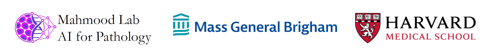

# Code for Multistain Pretraining for Slide Representation Learning in Pathology (ECCV'24)
[arXiv](https://arxiv.org/pdf/2408.02859) | [HuggingFace](https://huggingface.co/MahmoodLab/madeleine) | [Proceedings](https://www.ecva.net/papers/eccv_2024/papers_ECCV/html/4788_ECCV_2024_paper.php)

Welcome to the official GitHub repository of our ECCV 2024 paper, "Multistain Pretraining for Slide Representation Learning in Pathology". This project was developed at the [Mahmood Lab](https://faisal.ai/) at Harvard Medical School and Brigham and Women's Hospital.

## Abstract

Developing self-supervised learning (SSL) models that can learn universal and transferable representations of H&E gigapixel whole-slide images (WSIs) is becoming increasingly valuable in computational pathology. These models hold the potential to advance critical tasks such as few-shot classification, slide retrieval, and patient stratification. Existing approaches for slide representation learning extend the principles of SSL from small images (e.g., 224x224 patches) to entire slides, usually by aligning two different augmentations (or views) of the slide. Yet the resulting representation remains constrained by the limited clinical and biological diversity of the views. Instead, we postulate that slides stained with multiple markers, such as immunohistochemistry, can be used as different views to form a rich task-agnostic training signal. To this end, we introduce MADELEINE, a multimodal pretraining strategy for slide representation learning. MADELEINE is trained with a dual global-local cross-stain alignment objective on large cohorts of breast cancer samples (N=4,211 WSIs across five stains) and kidney transplant samples (N=12,070 WSIs across four stains). We demonstrate the quality of slide representations learned by MADELEINE on various downstream evaluations, ranging from morphological and molecular classification to prognostic prediction, comprising 21 tasks using 7,299 WSIs from multiple medical centers.

## Overview


## Installation 

```
# Clone repo
git clone https://github.com/mahmoodlab/MADELEINE
cd MADELEINE

# Create conda env
conda create --name madeleine python=3.9
conda activate madeleine
pip install -r requirements.txt
```

## Preprocessing: tissue segmentation, patching, and patch feature extraction

We are extracting [CONCH](https://github.com/mahmoodlab/CONCH) features at 10x magnification on 256x256-pixel patches. The script uses a new deep learning-based tissue segmentation that can provide off-the-shelf H&E and IHC tissue detection. 

```
cd ./bin
python extract_patch_embeddings.py \
    --slide_dir <PATH_TO_BCNB_SLIDES> \
    --local_dir ../results/BCNB \
    --patch_mag 10 \
    --patch_size 256
```

## Extracting MADELEINE slide encoding

You can run MADELEINE slide encoding (trained on 10x breast samples) using the [HuggingFace](https://huggingface.co/MahmoodLab/madeleine) checkpoint with:

```
cd ./bin
python extract_slide_embeddings.py --local_dir ../results/BCNB/
```

## Linear probe for molecular status prediction
To run linear probe using MADELEINE on BCNB molecular status prediction, run:

```
cd ./bin
python run_linear_probing.py --slide_embedding_pkl ../results/BCNB/madeleine_slide_embeddings.pkl  --label_path ../dataset_csv/BCNB/BCNB.csv 
```

BCNB slide embeddings can also be downloaded from [here](). The command performs linear probing for `k=1,10,25`, testing the data efficiency of the slide emebddings.

## MADELEINE slide embeddings against the state-of-the-art

All models are evaluated using linear probing without hyper-parameter tuning. MADELEINE slide embeddings are able to outperform various baselines, including GigaPath (Xu et al. *Nature*, 2024), on molecular status prediction:

|            | |   k=1   |      |  |   k=10  |      |  |   k=25  |      |
|------------|-----|-----|------|------|-----|------|------|-----|------|
|            | ER  | PR  | HER2 | ER   | PR  | HER2 | ER   | PR  | HER2 |
| **CONCH (Mean of patchh embs)** | 0.575   | 0.528   | 0.509   | 0.759    | 0.678   | 0.603   | 0.785    | 0.724   | 0.647   |
| **GigaPath (Mean of patch embs)**  | 0.568   | 0.523   | 0.501   | 0.718    | 0.657   | 0.588   | 0.762    | 0.71   | 0.637   |
| **GigaPath (slide encoder)**  | 0.555   | 0.514   | 0.498   | 0.691    | 0.636   | 0.577   | 0.741    | 0.689   | 0.618   |
| **MADELEINE (slide encoder)** | **0.664** | **0.537**   | **0.545**   | **0.818**    | **0.756**   | **0.662**   | **0.838**    | **0.791**   | **0.706**   |

# How to train your version of MADELEINE

## Train MADELEINE on Breast tissue using ACROBAT
```
cd ./bin

# launch pretraining without stain encodings
bash ../scripts/launch_pretrain_withoutStainEncodings.sh

# launch pretraining with stain encodings
bash ../scripts/launch_pretrain_withStainEncodings.sh

# launch both experiments
bash ../scripts/master.sh
```
NOTE: The pretrain script by default extracts the slide embeddings of the BCNB dataset used for downstream evaluation.

TIP: place the data directory on SSD for faster I/O and training. We use 3x24GB 3090Ti for training and it takes ~1 h to train MADELEINE.

## Issues 

- The preferred mode of communication is via GitHub issues.
- If GitHub issues are inappropriate, email avaidya@mit.edu (and cc gjaume@bwh.harvard.edu).
- Immediate response to minor issues may not be available.
- We cannot provide access to CONCH weights. Please refer to instructions on [CONCH GitHub page](https://github.com/mahmoodlab/CONCH).

## Cite
If you find our work useful in your research, please consider citing:

```
@inproceedings{jaume2024multistain,
  title={Multistain Pretraining for Slide Representation Learning in Pathology},
  author={Jaume, Guillaume and Vaidya, Anurag Jayant and Zhang, Andrew and Song, Andrew H and Chen, Richard J. and Sahai, Sharifa and Mo, Dandan and Madrigal, Emilio and Le, Long Phi and Mahmood Faisal},
  booktitle={European Conference on Computer Vision},
  year={2024},
  organization={Springer}
}
```

## License
This repository is licensed under the Creative Commons Attribution-NonCommercial-NoDerivatives 4.0 International (CC BY-NC-ND 4.0) license. You are free to download and share the work with proper attribution, but commercial use and modifications are not allowed. Please note that Creative Commons provides this license "as-is" without any warranties or liabilities.




